# Lab 01 Report - Introduction to Open Source Software
## 1. Discord
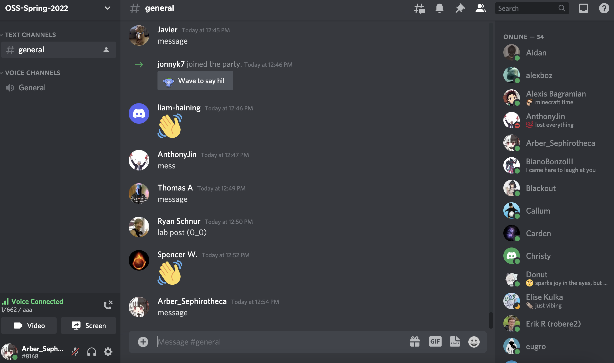

## 2. Reading
### Open Source Definition
OSD(Open Source Definition) is important because open source does not only mean access to source code. Distribution of open source software should follow certain rules: Open source software should be modified and distributed under same license; License should have no discrimination agianst any person, group or fields; Lience is not limited to electronic form(it could be any form).
### Smart Questions - How to ask the question The Smart Way
Before asking a question, try to find any resources that could answer you question.
When asking a question, choose a right forum that match the topic and difficulty of your question, and post with speicfic, meaningful subject header, with clear and informative content. When question is solved, follow up with a breif note on the solution: indicating whether the question is solved; posting a summary of troubleshooting history.
#### More suggestion
- Don't delete your question once it is solved. Other people may have same question as yours.
- Read the rules and guidelines of forum before asking.
### Free Culture - Chapter 3
 The copyright was originally intended to protect intellectual property of artist, but it is now being used by large companies to server their interest. Jess Jordan is a really good example: 
 Jesse Jordan built a intranet search engine based on Microsoft's network file system. Although he didn't make any money from the experiment and he was doing it for good intention, he was still sued by RIAA due to violating copyright law. The copyright reform on intellectual work initiated in the late 1950s and it lacks serious thought about how it would apply to computer program and networks.
The copyright law has failed to applied to new forms of creativity. Instead, it becomes a barrier for those talented, creative people who want to make innovation. So, a simple, comprehensible and coherent copyright law should be developed, and it should articulate the purpose it wants to achieve and gives some guidelines about how competing interest should be balanced.

## 3. Linux
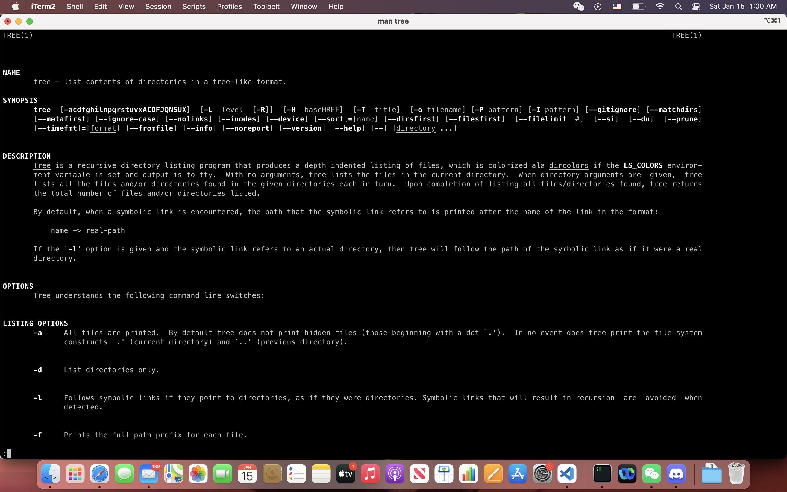

## Regex
### Practice Problem
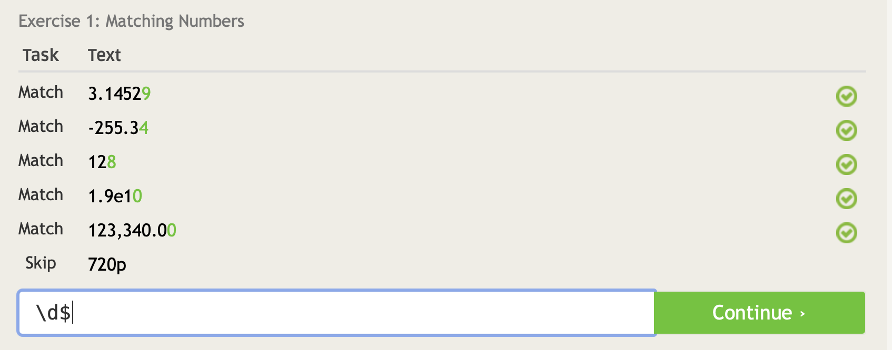
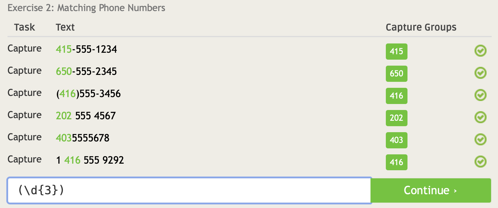
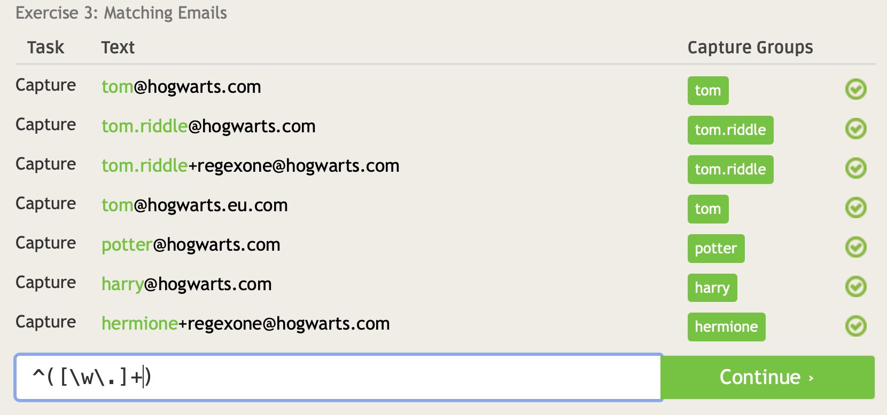
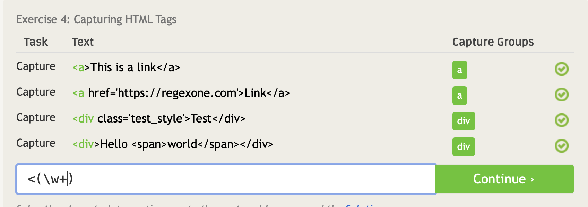
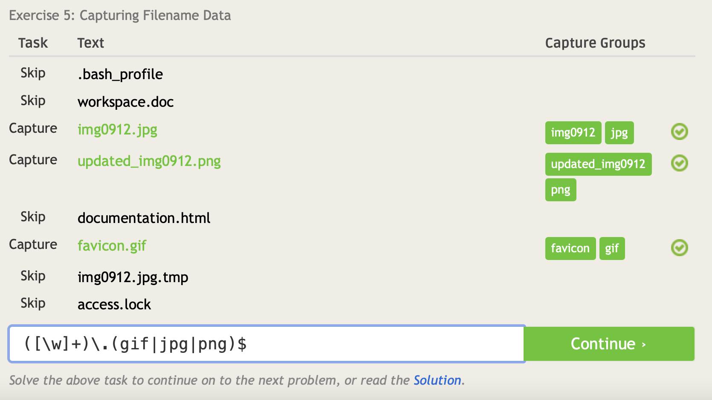
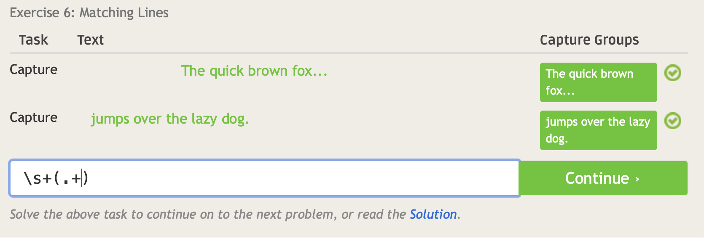
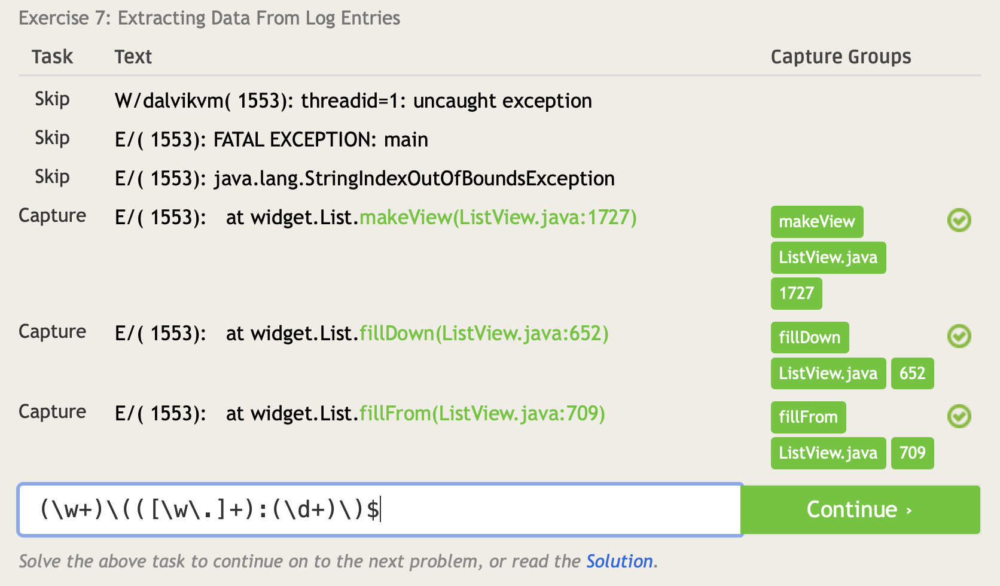
### Crosswords
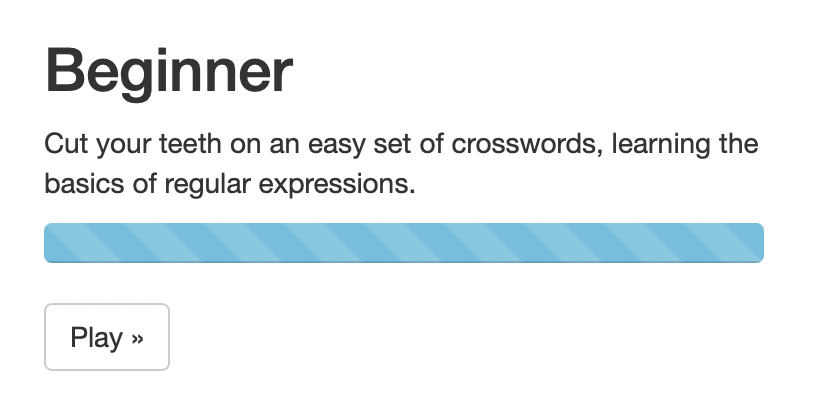
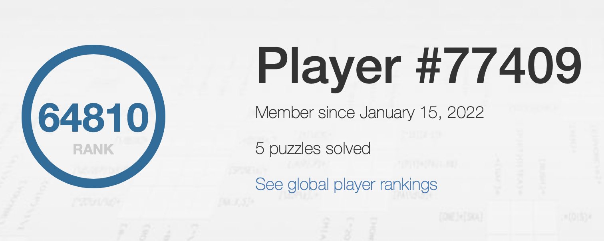

## 4. Blocky
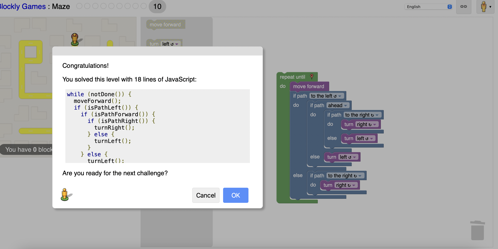

## 5. Reflection
I am  interested in database so I pick a key/value database open source project **[leveldb](https://github.com/google/leveldb)** to evaluate. First I read the  Google search the github page of project **dagoba**. When I entered in the github page of the project, I first read the **README.MD** file and then checked Github Wiki as they usually contain the introduction and information about project. After understanding about the basic architecture of project, I started looking at related paper "Bigtable: A Distributed Storage System for Structured Data" and then the source code of the project to try to understand how it is implemented.